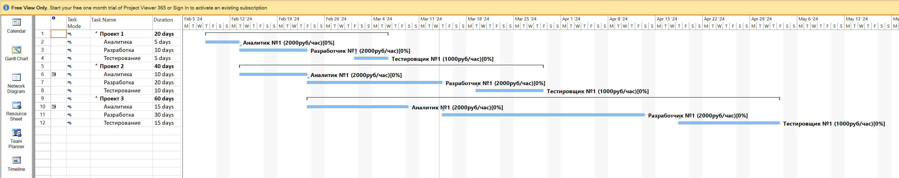

# hack-it-purple-2024
It Purple Hack


## Features:
 - [X] Support MS Project .xml file format
 - [X] Tasks and task groups
 - [X] 3 kinds of schedule optimizations:
   - by min duration
   - by min cost
   - by min resources
 - [X] MultiOptimization - sequential optimization by different combinations (e.g. cost, then duration) (EXTRA FEATURE)
 - [X] Multi skills per resources, e.g. when SA can work on analysis & development (EXTRA FEATURE)
 - [X] Fixed assignments, e.g. Only specific worker should perform a specific task (EXTRA FEATURE)
 - [X] Weighted optimization -> specify weights on cost, duration, resources (EXTRA FEATURE)
 - [X] Configure different profile to run: either draft solution or fine-tuned (EXTRA FEATURE)
 - [X] Hardware constraints, e.g. max 4 cpu to use (EXTRA FEATURE)
 - [X] nice cli & outputs :)

## How to run

### Create env using requirements.txt & set workspace
```shell
export PYTHONPATH=<hack-it-purple-2024 directory>
```

### Run with duration
```shell
python main.py -i "./inputs/new/исходные данные.xml" -o ./results/duration.xml -m duration
```

<details>

<summary>Console output for duration</summary>

```shell
[('2', 40, 'Аналитика', []),
 ('3', 80, 'Разработка', [0]),
 ('4', 40, 'Тестирование', [1]),
 ('6', 80, 'Аналитика', []),
 ('7', 160, 'Разработка', [3]),
 ('8', 80, 'Тестирование', [4]),
 ('10', 120, 'Аналитика', []),
 ('11', 240, 'Разработка', [6]),
 ('12', 120, 'Тестирование', [7])]
[('2', 4000, ['Разработка']),
 ('3', 2000, ['Аналитика']),
 ('4', 3000, ['Разработка']),
 ('5', 2000, ['Разработка']),
 ('6', 1500, ['Тестирование']),
 ('7', 1000, ['Тестирование'])]
Solving started...
Solution 0, time = 0.39 s, objective = 76
Solution 1, time = 0.39 s, objective = 75
Solution 2, time = 0.40 s, objective = 60
Solution found. Total objective func = 60.0


Task assignments:
2     :  □ □ □ □ □ □ □ □ □ □ □ □ □ □ □ □ □ □ □ □ □ □ □ □ □ □ □ □ □ □ □ □ □ □ □ □ □ □ □ □ ■ ■ ■ ■ ■ □ □ □ □ □ □ □ □ □ □ □ □ □ □ □ : 3
3     :  □ □ □ □ □ □ □ □ □ □ □ □ □ □ □ □ □ □ □ □ □ □ □ □ □ □ □ □ □ □ □ □ □ □ □ □ □ □ □ □ □ □ □ □ □ ■ ■ ■ ■ ■ ■ ■ ■ ■ ■ □ □ □ □ □ : 5
4     :  □ □ □ □ □ □ □ □ □ □ □ □ □ □ □ □ □ □ □ □ □ □ □ □ □ □ □ □ □ □ □ □ □ □ □ □ □ □ □ □ □ □ □ □ □ □ □ □ □ □ □ □ □ □ □ ■ ■ ■ ■ ■ : 6
6     :  □ □ □ □ □ □ □ □ □ □ □ □ □ □ □ ■ ■ ■ ■ ■ ■ ■ ■ ■ ■ □ □ □ □ □ □ □ □ □ □ □ □ □ □ □ □ □ □ □ □ □ □ □ □ □ □ □ □ □ □ □ □ □ □ □ : 3
7     :  □ □ □ □ □ □ □ □ □ □ □ □ □ □ □ □ □ □ □ □ □ □ □ □ □ ■ ■ ■ ■ ■ ■ ■ ■ ■ ■ ■ ■ ■ ■ ■ ■ ■ ■ ■ ■ □ □ □ □ □ □ □ □ □ □ □ □ □ □ □ : 5
8     :  □ □ □ □ □ □ □ □ □ □ □ □ □ □ □ □ □ □ □ □ □ □ □ □ □ □ □ □ □ □ □ □ □ □ □ □ □ □ □ □ □ □ □ □ □ ■ ■ ■ ■ ■ ■ ■ ■ ■ ■ □ □ □ □ □ : 6
10    :  ■ ■ ■ ■ ■ ■ ■ ■ ■ ■ ■ ■ ■ ■ ■ □ □ □ □ □ □ □ □ □ □ □ □ □ □ □ □ □ □ □ □ □ □ □ □ □ □ □ □ □ □ □ □ □ □ □ □ □ □ □ □ □ □ □ □ □ : 3
11    :  □ □ □ □ □ □ □ □ □ □ □ □ □ □ □ ■ ■ ■ ■ ■ ■ ■ ■ ■ ■ ■ ■ ■ ■ ■ ■ ■ ■ ■ ■ ■ ■ ■ ■ ■ ■ ■ ■ ■ ■ □ □ □ □ □ □ □ □ □ □ □ □ □ □ □ : 2
12    :  □ □ □ □ □ □ □ □ □ □ □ □ □ □ □ □ □ □ □ □ □ □ □ □ □ □ □ □ □ □ □ □ □ □ □ □ □ □ □ □ □ □ □ □ □ ■ ■ ■ ■ ■ ■ ■ ■ ■ ■ ■ ■ ■ ■ ■ : 7

=============================
Resources assignments:
2     :  □ □ □ □ □ □ □ □ □ □ □ □ □ □ □ * * * * * * * * * * * * * * * * * * * * * * * * * * * * * * □ □ □ □ □ □ □ □ □ □ □ □ □ □ □
3     :  © © © © © © © © © © © © © © © ♠ ♠ ♠ ♠ ♠ ♠ ♠ ♠ ♠ ♠ □ □ □ □ □ □ □ □ □ □ □ □ □ □ □ ♥ ♥ ♥ ♥ ♥ □ □ □ □ □ □ □ □ □ □ □ □ □ □ □
4     :  □ □ □ □ □ □ □ □ □ □ □ □ □ □ □ □ □ □ □ □ □ □ □ □ □ □ □ □ □ □ □ □ □ □ □ □ □ □ □ □ □ □ □ □ □ □ □ □ □ □ □ □ □ □ □ □ □ □ □ □
5     :  □ □ □ □ □ □ □ □ □ □ □ □ □ □ □ □ □ □ □ □ □ □ □ □ □ ▲ ▲ ▲ ▲ ▲ ▲ ▲ ▲ ▲ ▲ ▲ ▲ ▲ ▲ ▲ ▲ ▲ ▲ ▲ ▲ ♦ ♦ ♦ ♦ ♦ ♦ ♦ ♦ ♦ ♦ □ □ □ □ □
6     :  □ □ □ □ □ □ □ □ □ □ □ □ □ □ □ □ □ □ □ □ □ □ □ □ □ □ □ □ □ □ □ □ □ □ □ □ □ □ □ □ □ □ □ □ □ ▼ ▼ ▼ ▼ ▼ ▼ ▼ ▼ ▼ ▼ ♣ ♣ ♣ ♣ ♣
7     :  □ □ □ □ □ □ □ □ □ □ □ □ □ □ □ □ □ □ □ □ □ □ □ □ □ □ □ □ □ □ □ □ □ □ □ □ □ □ □ □ □ □ □ □ □ 0 0 0 0 0 0 0 0 0 0 0 0 0 0 0

--- Legend ---
 ♥: 2
 ♦: 3
 ♣: 4
 ♠: 6
 ▲: 7
 ▼: 8
 ©: 10
 *: 11
 0: 12
```

</details>

### Duration file result [duration.xml](results/duration.xml)

### Duration image


***

### Run with cost
```shell
python main.py -i "./inputs/new/исходные данные.xml" -o ./results/cost.xml -m cost
```

<details>

<summary>Console output for cost</summary>

```shell
[('2', 40, 'Аналитика', []),
 ('3', 80, 'Разработка', [0]),
 ('4', 40, 'Тестирование', [1]),
 ('6', 80, 'Аналитика', []),
 ('7', 160, 'Разработка', [3]),
 ('8', 80, 'Тестирование', [4]),
 ('10', 120, 'Аналитика', []),
 ('11', 240, 'Разработка', [6]),
 ('12', 120, 'Тестирование', [7])]
[('2', 4000, ['Разработка']),
 ('3', 2000, ['Аналитика']),
 ('4', 3000, ['Разработка']),
 ('5', 2000, ['Разработка']),
 ('6', 1500, ['Тестирование']),
 ('7', 1000, ['Тестирование'])]
Solving started...
Solution 0, time = 0.71 s, objective = 2300000
Solution 1, time = 0.73 s, objective = 2240000
Solution 2, time = 0.75 s, objective = 2080000
Solution 3, time = 0.77 s, objective = 2000000
Solution 4, time = 0.78 s, objective = 1840000
Solution 5, time = 0.81 s, objective = 1760000
Solution 6, time = 0.82 s, objective = 1740000
Solution 7, time = 0.84 s, objective = 1720000
Solution 8, time = 0.85 s, objective = 1700000
Solution 9, time = 0.85 s, objective = 1680000
Solution found. Total objective func = 1680000.0


Task assignments:
2     :  □ □ □ □ □ □ □ □ □ □ □ □ □ □ □ □ □ □ □ □ □ □ □ □ □ ■ ■ ■ ■ ■ □ □ □ □ □ □ □ □ □ □ □ □ □ □ □ □ □ □ □ □ □ □ □ □ □ □ □ □ □ □ □ □ □ □ □ □ □ □ □ □ □ □ □ □ □ □ □ □ □ □ : 3
3     :  □ □ □ □ □ □ □ □ □ □ □ □ □ □ □ □ □ □ □ □ □ □ □ □ □ □ □ □ □ □ □ □ □ □ □ □ □ □ □ □ □ □ □ □ □ □ □ □ □ □ □ □ □ □ □ □ □ □ □ □ □ □ □ □ □ ■ ■ ■ ■ ■ ■ ■ ■ ■ ■ □ □ □ □ □ : 5
4     :  □ □ □ □ □ □ □ □ □ □ □ □ □ □ □ □ □ □ □ □ □ □ □ □ □ □ □ □ □ □ □ □ □ □ □ □ □ □ □ □ □ □ □ □ □ □ □ □ □ □ □ □ □ □ □ □ □ □ □ □ □ □ □ □ □ □ □ □ □ □ □ □ □ □ □ ■ ■ ■ ■ ■ : 7
6     :  □ □ □ □ □ □ □ □ □ □ □ □ □ □ □ ■ ■ ■ ■ ■ ■ ■ ■ ■ ■ □ □ □ □ □ □ □ □ □ □ □ □ □ □ □ □ □ □ □ □ □ □ □ □ □ □ □ □ □ □ □ □ □ □ □ □ □ □ □ □ □ □ □ □ □ □ □ □ □ □ □ □ □ □ □ : 3
7     :  □ □ □ □ □ □ □ □ □ □ □ □ □ □ □ □ □ □ □ □ □ □ □ □ □ □ □ □ □ □ □ □ □ □ □ □ □ □ □ □ □ □ □ □ □ ■ ■ ■ ■ ■ ■ ■ ■ ■ ■ ■ ■ ■ ■ ■ ■ ■ ■ ■ ■ □ □ □ □ □ □ □ □ □ □ □ □ □ □ □ : 5
8     :  □ □ □ □ □ □ □ □ □ □ □ □ □ □ □ □ □ □ □ □ □ □ □ □ □ □ □ □ □ □ □ □ □ □ □ □ □ □ □ □ □ □ □ □ □ □ □ □ □ □ □ □ □ □ □ □ □ □ □ □ □ □ □ □ □ ■ ■ ■ ■ ■ ■ ■ ■ ■ ■ □ □ □ □ □ : 7
10    :  ■ ■ ■ ■ ■ ■ ■ ■ ■ ■ ■ ■ ■ ■ ■ □ □ □ □ □ □ □ □ □ □ □ □ □ □ □ □ □ □ □ □ □ □ □ □ □ □ □ □ □ □ □ □ □ □ □ □ □ □ □ □ □ □ □ □ □ □ □ □ □ □ □ □ □ □ □ □ □ □ □ □ □ □ □ □ □ : 3
11    :  □ □ □ □ □ □ □ □ □ □ □ □ □ □ □ ■ ■ ■ ■ ■ ■ ■ ■ ■ ■ ■ ■ ■ ■ ■ ■ ■ ■ ■ ■ ■ ■ ■ ■ ■ ■ ■ ■ ■ ■ □ □ □ □ □ □ □ □ □ □ □ □ □ □ □ □ □ □ □ □ □ □ □ □ □ □ □ □ □ □ □ □ □ □ □ : 5
12    :  □ □ □ □ □ □ □ □ □ □ □ □ □ □ □ □ □ □ □ □ □ □ □ □ □ □ □ □ □ □ □ □ □ □ □ □ □ □ □ □ □ □ □ □ □ ■ ■ ■ ■ ■ ■ ■ ■ ■ ■ ■ ■ ■ ■ ■ □ □ □ □ □ □ □ □ □ □ □ □ □ □ □ □ □ □ □ □ : 7

=============================
Resources assignments:
2     :  □ □ □ □ □ □ □ □ □ □ □ □ □ □ □ □ □ □ □ □ □ □ □ □ □ □ □ □ □ □ □ □ □ □ □ □ □ □ □ □ □ □ □ □ □ □ □ □ □ □ □ □ □ □ □ □ □ □ □ □ □ □ □ □ □ □ □ □ □ □ □ □ □ □ □ □ □ □ □ □
3     :  © © © © © © © © © © © © © © © ♠ ♠ ♠ ♠ ♠ ♠ ♠ ♠ ♠ ♠ ♥ ♥ ♥ ♥ ♥ □ □ □ □ □ □ □ □ □ □ □ □ □ □ □ □ □ □ □ □ □ □ □ □ □ □ □ □ □ □ □ □ □ □ □ □ □ □ □ □ □ □ □ □ □ □ □ □ □ □
4     :  □ □ □ □ □ □ □ □ □ □ □ □ □ □ □ □ □ □ □ □ □ □ □ □ □ □ □ □ □ □ □ □ □ □ □ □ □ □ □ □ □ □ □ □ □ □ □ □ □ □ □ □ □ □ □ □ □ □ □ □ □ □ □ □ □ □ □ □ □ □ □ □ □ □ □ □ □ □ □ □
5     :  □ □ □ □ □ □ □ □ □ □ □ □ □ □ □ * * * * * * * * * * * * * * * * * * * * * * * * * * * * * * ▲ ▲ ▲ ▲ ▲ ▲ ▲ ▲ ▲ ▲ ▲ ▲ ▲ ▲ ▲ ▲ ▲ ▲ ▲ ▲ ♦ ♦ ♦ ♦ ♦ ♦ ♦ ♦ ♦ ♦ □ □ □ □ □
6     :  □ □ □ □ □ □ □ □ □ □ □ □ □ □ □ □ □ □ □ □ □ □ □ □ □ □ □ □ □ □ □ □ □ □ □ □ □ □ □ □ □ □ □ □ □ □ □ □ □ □ □ □ □ □ □ □ □ □ □ □ □ □ □ □ □ □ □ □ □ □ □ □ □ □ □ □ □ □ □ □
7     :  □ □ □ □ □ □ □ □ □ □ □ □ □ □ □ □ □ □ □ □ □ □ □ □ □ □ □ □ □ □ □ □ □ □ □ □ □ □ □ □ □ □ □ □ □ 0 0 0 0 0 0 0 0 0 0 0 0 0 0 0 □ □ □ □ □ ▼ ▼ ▼ ▼ ▼ ▼ ▼ ▼ ▼ ▼ ♣ ♣ ♣ ♣ ♣

--- Legend ---
 ♥: 2
 ♦: 3
 ♣: 4
 ♠: 6
 ▲: 7
 ▼: 8
 ©: 10
 *: 11
 0: 12
```

</details>

### Cost file result [cost.xml](results/cost.xml)

### Cost image


***

### Run with resources
```shell
python main.py -i "./inputs/new/исходные данные.xml" -o ./results/resources.xml -m resources
```

<details>

<summary>Console output for resources</summary>

```shell
[('2', 40, 'Аналитика', []),
 ('3', 80, 'Разработка', [0]),
 ('4', 40, 'Тестирование', [1]),
 ('6', 80, 'Аналитика', []),
 ('7', 160, 'Разработка', [3]),
 ('8', 80, 'Тестирование', [4]),
 ('10', 120, 'Аналитика', []),
 ('11', 240, 'Разработка', [6]),
 ('12', 120, 'Тестирование', [7])]
[('2', 4000, ['Разработка']),
 ('3', 2000, ['Аналитика']),
 ('4', 3000, ['Разработка']),
 ('5', 2000, ['Разработка']),
 ('6', 1500, ['Тестирование']),
 ('7', 1000, ['Тестирование'])]
Solving started...
Solution 0, time = 0.55 s, objective = 4
Solution 1, time = 0.59 s, objective = 3
Solution found. Total objective func = 3.0


Task assignments:
2     :  □ □ □ ■ ■ ■ ■ ■ □ □ □ □ □ □ □ □ □ □ □ □ □ □ □ □ □ □ □ □ □ □ □ □ □ □ □ □ □ □ □ □ □ □ □ □ □ □ □ □ □ □ □ □ □ □ □ □ □ □ □ □ □ □ □ □ □ □ □ □ □ □ □ □ □ □ □ □ □ □ □ □ □ □ □ □ □ □ □ □ : 3
3     :  □ □ □ □ □ □ □ □ ■ ■ ■ ■ ■ ■ ■ ■ ■ ■ □ □ □ □ □ □ □ □ □ □ □ □ □ □ □ □ □ □ □ □ □ □ □ □ □ □ □ □ □ □ □ □ □ □ □ □ □ □ □ □ □ □ □ □ □ □ □ □ □ □ □ □ □ □ □ □ □ □ □ □ □ □ □ □ □ □ □ □ □ □ : 5
4     :  □ □ □ □ □ □ □ □ □ □ □ □ □ □ □ □ □ □ □ □ □ □ □ □ □ ■ ■ ■ ■ ■ □ □ □ □ □ □ □ □ □ □ □ □ □ □ □ □ □ □ □ □ □ □ □ □ □ □ □ □ □ □ □ □ □ □ □ □ □ □ □ □ □ □ □ □ □ □ □ □ □ □ □ □ □ □ □ □ □ □ : 7
6     :  □ □ □ □ □ □ □ □ ■ ■ ■ ■ ■ ■ ■ ■ ■ ■ □ □ □ □ □ □ □ □ □ □ □ □ □ □ □ □ □ □ □ □ □ □ □ □ □ □ □ □ □ □ □ □ □ □ □ □ □ □ □ □ □ □ □ □ □ □ □ □ □ □ □ □ □ □ □ □ □ □ □ □ □ □ □ □ □ □ □ □ □ □ : 3
7     :  □ □ □ □ □ □ □ □ □ □ □ □ □ □ □ □ □ □ ■ ■ ■ ■ ■ ■ ■ ■ ■ ■ ■ ■ ■ ■ ■ ■ ■ ■ ■ ■ □ □ □ □ □ □ □ □ □ □ □ □ □ □ □ □ □ □ □ □ □ □ □ □ □ □ □ □ □ □ □ □ □ □ □ □ □ □ □ □ □ □ □ □ □ □ □ □ □ □ : 5
8     :  □ □ □ □ □ □ □ □ □ □ □ □ □ □ □ □ □ □ □ □ □ □ □ □ □ □ □ □ □ □ □ □ □ □ □ □ □ □ □ □ □ □ □ ■ ■ ■ ■ ■ ■ ■ ■ ■ ■ □ □ □ □ □ □ □ □ □ □ □ □ □ □ □ □ □ □ □ □ □ □ □ □ □ □ □ □ □ □ □ □ □ □ □ : 7
10    :  □ □ □ □ □ □ □ □ □ □ □ □ □ □ □ □ □ □ ■ ■ ■ ■ ■ ■ ■ ■ ■ ■ ■ ■ ■ ■ ■ □ □ □ □ □ □ □ □ □ □ □ □ □ □ □ □ □ □ □ □ □ □ □ □ □ □ □ □ □ □ □ □ □ □ □ □ □ □ □ □ □ □ □ □ □ □ □ □ □ □ □ □ □ □ □ : 3
11    :  □ □ □ □ □ □ □ □ □ □ □ □ □ □ □ □ □ □ □ □ □ □ □ □ □ □ □ □ □ □ □ □ □ □ □ □ □ □ ■ ■ ■ ■ ■ ■ ■ ■ ■ ■ ■ ■ ■ ■ ■ ■ ■ ■ ■ ■ ■ ■ ■ ■ ■ ■ ■ ■ ■ ■ □ □ □ □ □ □ □ □ □ □ □ □ □ □ □ □ □ □ □ □ : 5
12    :  □ □ □ □ □ □ □ □ □ □ □ □ □ □ □ □ □ □ □ □ □ □ □ □ □ □ □ □ □ □ □ □ □ □ □ □ □ □ □ □ □ □ □ □ □ □ □ □ □ □ □ □ □ □ □ □ □ □ □ □ □ □ □ □ □ □ □ □ □ □ □ □ □ ■ ■ ■ ■ ■ ■ ■ ■ ■ ■ ■ ■ ■ ■ ■ : 7

=============================
Resources assignments:
2     :  □ □ □ □ □ □ □ □ □ □ □ □ □ □ □ □ □ □ □ □ □ □ □ □ □ □ □ □ □ □ □ □ □ □ □ □ □ □ □ □ □ □ □ □ □ □ □ □ □ □ □ □ □ □ □ □ □ □ □ □ □ □ □ □ □ □ □ □ □ □ □ □ □ □ □ □ □ □ □ □ □ □ □ □ □ □ □ □
3     :  □ □ □ ♥ ♥ ♥ ♥ ♥ ♠ ♠ ♠ ♠ ♠ ♠ ♠ ♠ ♠ ♠ © © © © © © © © © © © © © © © □ □ □ □ □ □ □ □ □ □ □ □ □ □ □ □ □ □ □ □ □ □ □ □ □ □ □ □ □ □ □ □ □ □ □ □ □ □ □ □ □ □ □ □ □ □ □ □ □ □ □ □ □ □ □
4     :  □ □ □ □ □ □ □ □ □ □ □ □ □ □ □ □ □ □ □ □ □ □ □ □ □ □ □ □ □ □ □ □ □ □ □ □ □ □ □ □ □ □ □ □ □ □ □ □ □ □ □ □ □ □ □ □ □ □ □ □ □ □ □ □ □ □ □ □ □ □ □ □ □ □ □ □ □ □ □ □ □ □ □ □ □ □ □ □
5     :  □ □ □ □ □ □ □ □ ♦ ♦ ♦ ♦ ♦ ♦ ♦ ♦ ♦ ♦ ▲ ▲ ▲ ▲ ▲ ▲ ▲ ▲ ▲ ▲ ▲ ▲ ▲ ▲ ▲ ▲ ▲ ▲ ▲ ▲ * * * * * * * * * * * * * * * * * * * * * * * * * * * * * * □ □ □ □ □ □ □ □ □ □ □ □ □ □ □ □ □ □ □ □
6     :  □ □ □ □ □ □ □ □ □ □ □ □ □ □ □ □ □ □ □ □ □ □ □ □ □ □ □ □ □ □ □ □ □ □ □ □ □ □ □ □ □ □ □ □ □ □ □ □ □ □ □ □ □ □ □ □ □ □ □ □ □ □ □ □ □ □ □ □ □ □ □ □ □ □ □ □ □ □ □ □ □ □ □ □ □ □ □ □
7     :  □ □ □ □ □ □ □ □ □ □ □ □ □ □ □ □ □ □ □ □ □ □ □ □ □ ♣ ♣ ♣ ♣ ♣ □ □ □ □ □ □ □ □ □ □ □ □ □ ▼ ▼ ▼ ▼ ▼ ▼ ▼ ▼ ▼ ▼ □ □ □ □ □ □ □ □ □ □ □ □ □ □ □ □ □ □ □ □ 0 0 0 0 0 0 0 0 0 0 0 0 0 0 0

--- Legend ---
 ♥: 2
 ♦: 3
 ♣: 4
 ♠: 6
 ▲: 7
 ▼: 8
 ©: 10
 *: 11
 0: 12
```

</details>

### Resources file result [resources.xml](results/resources.xml)

### Resources image




***

### Run with duration-cost combination
```shell
python main.py -i "./inputs/new/исходные данные.xml" -o ./results/duration_cost.xml -m duration cost
```

<details>

<summary>Console output for duration cost</summary>

```shell
[('2', 40, 'Аналитика', []),
 ('3', 80, 'Разработка', [0]),
 ('4', 40, 'Тестирование', [1]),
 ('6', 80, 'Аналитика', []),
 ('7', 160, 'Разработка', [3]),
 ('8', 80, 'Тестирование', [4]),
 ('10', 120, 'Аналитика', []),
 ('11', 240, 'Разработка', [6]),
 ('12', 120, 'Тестирование', [7])]
[('2', 4000, ['Разработка']),
 ('3', 2000, ['Аналитика']),
 ('4', 3000, ['Разработка']),
 ('5', 2000, ['Разработка']),
 ('6', 1500, ['Тестирование']),
 ('7', 1000, ['Тестирование'])]
Solving started...
Solution 0, time = 0.38 s, objective = 76
Solution 1, time = 0.39 s, objective = 75
Solution 2, time = 0.42 s, objective = 60
Solution found. Total objective func = 60.0

Solving started...
Solution 0, time = 0.08 s, objective = 2300000
Solution 1, time = 0.08 s, objective = 2280000
Solution 2, time = 0.09 s, objective = 2060000
Solution 3, time = 0.09 s, objective = 2040000
Solution 4, time = 0.09 s, objective = 1960000
Solution 5, time = 0.09 s, objective = 1900000
Solution found. Total objective func = 1900000.0


Task assignments:
2     :  □ □ □ □ □ □ □ □ □ □ □ □ □ □ □ □ □ □ □ □ □ □ □ □ □ ■ ■ ■ ■ ■ □ □ □ □ □ □ □ □ □ □ □ □ □ □ □ □ □ □ □ □ □ □ □ □ □ □ □ □ □ □ : 3
3     :  □ □ □ □ □ □ □ □ □ □ □ □ □ □ □ □ □ □ □ □ □ □ □ □ □ □ □ □ □ □ □ □ □ □ □ □ □ □ □ □ □ □ □ □ □ ■ ■ ■ ■ ■ ■ ■ ■ ■ ■ □ □ □ □ □ : 5
4     :  □ □ □ □ □ □ □ □ □ □ □ □ □ □ □ □ □ □ □ □ □ □ □ □ □ □ □ □ □ □ □ □ □ □ □ □ □ □ □ □ □ □ □ □ □ □ □ □ □ □ □ □ □ □ □ ■ ■ ■ ■ ■ : 7
6     :  □ □ □ □ □ □ □ □ □ □ □ □ □ □ □ ■ ■ ■ ■ ■ ■ ■ ■ ■ ■ □ □ □ □ □ □ □ □ □ □ □ □ □ □ □ □ □ □ □ □ □ □ □ □ □ □ □ □ □ □ □ □ □ □ □ : 3
7     :  □ □ □ □ □ □ □ □ □ □ □ □ □ □ □ □ □ □ □ □ □ □ □ □ □ ■ ■ ■ ■ ■ ■ ■ ■ ■ ■ ■ ■ ■ ■ ■ ■ ■ ■ ■ ■ □ □ □ □ □ □ □ □ □ □ □ □ □ □ □ : 4
8     :  □ □ □ □ □ □ □ □ □ □ □ □ □ □ □ □ □ □ □ □ □ □ □ □ □ □ □ □ □ □ □ □ □ □ □ □ □ □ □ □ □ □ □ □ □ ■ ■ ■ ■ ■ ■ ■ ■ ■ ■ □ □ □ □ □ : 7
10    :  ■ ■ ■ ■ ■ ■ ■ ■ ■ ■ ■ ■ ■ ■ ■ □ □ □ □ □ □ □ □ □ □ □ □ □ □ □ □ □ □ □ □ □ □ □ □ □ □ □ □ □ □ □ □ □ □ □ □ □ □ □ □ □ □ □ □ □ : 3
11    :  □ □ □ □ □ □ □ □ □ □ □ □ □ □ □ ■ ■ ■ ■ ■ ■ ■ ■ ■ ■ ■ ■ ■ ■ ■ ■ ■ ■ ■ ■ ■ ■ ■ ■ ■ ■ ■ ■ ■ ■ □ □ □ □ □ □ □ □ □ □ □ □ □ □ □ : 5
12    :  □ □ □ □ □ □ □ □ □ □ □ □ □ □ □ □ □ □ □ □ □ □ □ □ □ □ □ □ □ □ □ □ □ □ □ □ □ □ □ □ □ □ □ □ □ ■ ■ ■ ■ ■ ■ ■ ■ ■ ■ ■ ■ ■ ■ ■ : 6

=============================
Resources assignments:
2     :  □ □ □ □ □ □ □ □ □ □ □ □ □ □ □ □ □ □ □ □ □ □ □ □ □ □ □ □ □ □ □ □ □ □ □ □ □ □ □ □ □ □ □ □ □ □ □ □ □ □ □ □ □ □ □ □ □ □ □ □
3     :  © © © © © © © © © © © © © © © ♠ ♠ ♠ ♠ ♠ ♠ ♠ ♠ ♠ ♠ ♥ ♥ ♥ ♥ ♥ □ □ □ □ □ □ □ □ □ □ □ □ □ □ □ □ □ □ □ □ □ □ □ □ □ □ □ □ □ □
4     :  □ □ □ □ □ □ □ □ □ □ □ □ □ □ □ □ □ □ □ □ □ □ □ □ □ ▲ ▲ ▲ ▲ ▲ ▲ ▲ ▲ ▲ ▲ ▲ ▲ ▲ ▲ ▲ ▲ ▲ ▲ ▲ ▲ □ □ □ □ □ □ □ □ □ □ □ □ □ □ □
5     :  □ □ □ □ □ □ □ □ □ □ □ □ □ □ □ * * * * * * * * * * * * * * * * * * * * * * * * * * * * * * ♦ ♦ ♦ ♦ ♦ ♦ ♦ ♦ ♦ ♦ □ □ □ □ □
6     :  □ □ □ □ □ □ □ □ □ □ □ □ □ □ □ □ □ □ □ □ □ □ □ □ □ □ □ □ □ □ □ □ □ □ □ □ □ □ □ □ □ □ □ □ □ 0 0 0 0 0 0 0 0 0 0 0 0 0 0 0
7     :  □ □ □ □ □ □ □ □ □ □ □ □ □ □ □ □ □ □ □ □ □ □ □ □ □ □ □ □ □ □ □ □ □ □ □ □ □ □ □ □ □ □ □ □ □ ▼ ▼ ▼ ▼ ▼ ▼ ▼ ▼ ▼ ▼ ♣ ♣ ♣ ♣ ♣

--- Legend ---
 ♥: 2
 ♦: 3
 ♣: 4
 ♠: 6
 ▲: 7
 ▼: 8
 ©: 10
 *: 11
 0: 12
```

</details>

### duration_cost file result [duration_cost.xml](results/duration_cost.xml)

### duration_cost image

